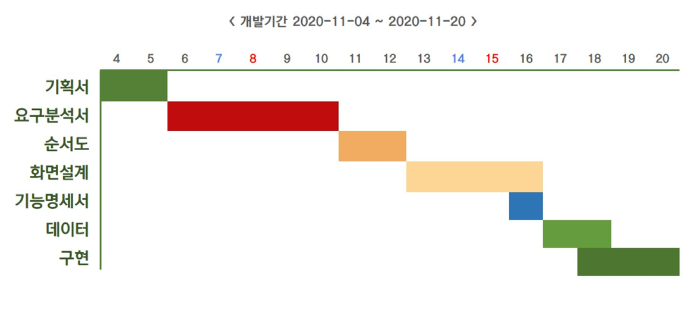
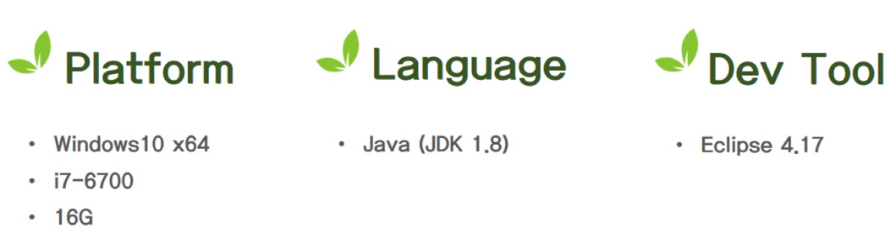
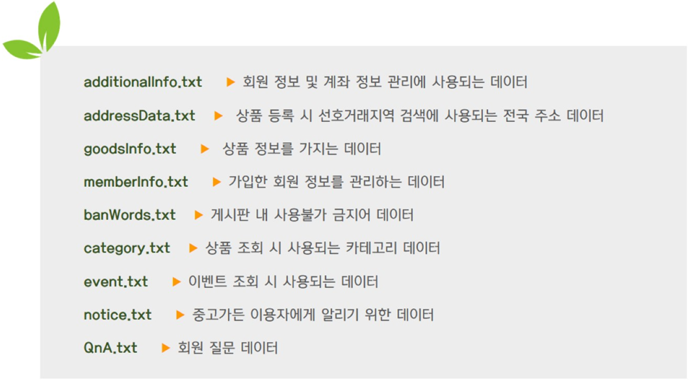

# 중고가든 Joongo Garden🏡

__중고가든은 Java Console 기반 중고거래 프로그램 입니다.__

### 특징 Feature
+ 지역별/카테고리별 상품리스트 조회 및 검색
+ 안전거래 시스템

### 프로젝트 일정 Project Schedule

### 개발 환경 Develop Environment

### 개발 팀원 Project Member
+ __김주혁__
+ 나문오
+ 박지현
+ 신우철
+ 이찬미
+ 최진영

### 데이터 구조 Data Structure

### 담당 업무 구현 Development

### 후기 Comment
    교육센터 교육 과정 첫 프로젝트
  대학교에서 하던 토이 프로젝트와 사뭇 다른 느낌이었다. 첫 프로젝트부터 조장을 맡아서 그런 것일지도 모른다. 업무 분배는 팀원들과 커뮤니케이션을 통해 원하는 파트를 선택할 수 있도록 했다. 아쉬웠던 점은 구현 시작 전에 기본 틀을 정해주지 못한 것이다. 이로 인해 구현 중간에 소스 코드를 합쳐서 구동해봤을 때 오류투성이라 해결하기 힘들었다.😰   
첫 프로젝트이다 보니 아쉬운 점이 많았지만 나름 성취감도 느꼈고 다음 프로젝트에 밑거름이 되기에 충분하다고 생각한다.
